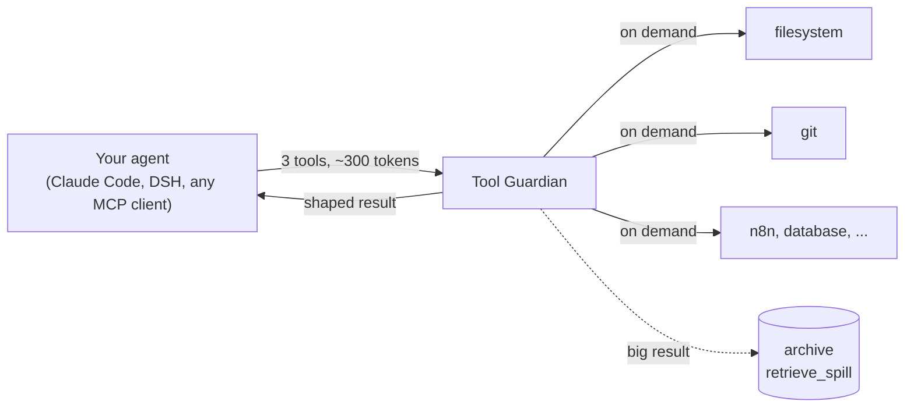

<h1 align="center">Tool Guardian</h1>

<p align="center"><b>Your MCP servers, for ~300 tokens instead of ~28,000 &mdash; and tool results that stop flooding the window.</b></p>

<p align="center">
  
  
  
  
  
</p>

<p align="center">
  <a href="#why-this-exists">Why</a> &middot;
  <a href="#two-ways-to-run-it">Two ways to run it</a> &middot;
  <a href="#install">Install</a> &middot;
  <a href="#see-what-it-saves">Measure it</a> &middot;
  <a href="#it-keeps-tool-results-small-too-030">Output ladder</a> &middot;
  <a href="#native-deepseek-harness-dsh-bundle">DSH bundle</a> &middot;
  <a href="CHANGELOG.md">Changelog</a>
</p>

An MCP server that sits in front of your other MCP servers and exposes **three generic tools** instead of dozens of specific ones — discovering the rest **on demand** — so tool definitions stop eating your context window before the model reads a word.

Companion to [Context Guardian](https://github.com/LuminariSoftwares/context-guardian): **Context Guardian compacts the conversation before the window fills; Tool Guardian keeps the tools from filling it in the first place.** Two halves of the same problem.

| | Without Tool Guardian | With it |
|---|---|---|
| 7 MCP servers on a 32K model | **28,689 tokens** of schemas on every request (87.6 % of the window) | **~300 tokens**; a schema is fetched only when the model asks |
| A 50 KB shell result | 51,165 characters land in the conversation | **7,833 characters**, the full original archived and one call away |
| DSH first request (measured) | 46 tools, 37,154 characters of schema | **22 tools, 18,503 characters** |
| A backend that fails to start | an empty tool list the model silently works around | `UNKNOWN` with the real error |

## Why this exists

MCP tool definitions are re-sent on **every single request**, whether the model touches them or not. A handful of servers routinely comes to tens of thousands of tokens — often most of a small local model's window — before the first user message. On one real setup, seven MCP servers came to **28,689 tokens, 87.6% of a 32K window**, as a fixed floor under everything else.

You have two ways to deal with that today, and both cost you something:

| Approach | The cost |
|---|---|
| Load fewer MCP servers | You lose the capability entirely |
| Live with it | Two-thirds of the window is gone before you type |

Tool Guardian is a third option that costs neither. It fronts all your servers and shows the model just three tools plus a one-line catalogue of server names (~300 tokens). The full schema for a tool is fetched only when the model asks for it:

```
list_capabilities(server?)      one line per tool — names and purpose
describe_tool(server, tool)     the full argument schema for ONE tool
call_tool(server, tool, args)   invoke it, return the result
```

Same idea as a search index: cheap catalogue always visible, detail on demand.

## Model requirement (read this before you switch)

The whole design rests on one behaviour: the model must **proactively call `list_capabilities` (then `call_tool`) when it needs a tool.** Capable/frontier models do this reliably. Small local models are less certain — and, as the two measurements below show, **the harness the model runs in matters as much as the model.**

**Measurement 1 — August 2026, OpenClaude, router mounted over MCP.** Against a real studio stack, **gpt-oss:20b and qwen3-30b-a3b both bypassed the router** on ordinary tasks — even with the `NEXT STEP` nudge in every result *and* a dedicated router sub-agent priming them. They treated a tool name as a shell command or scripted their way around it. Part of that was the harness, not the models: gpt-oss:20b did call `list_capabilities` correctly but could not carry the discovery into `call_tool` inside a general task, and the one approach that completed the sequence (the sub-agent) was blocked by the harness's own agent-tool argument validation before it ever reached the router.

**Measurement 2 — 2026-09-19 and 2026-09-21, DeepSeek Harness, router tools registered natively by the [DSH bundle](#native-deepseek-harness-dsh-bundle).** The same model family (`qwen3:30b-a3b-instruct-2507`, 32K window) **used the router with no bypass.** 09-19, two sessions whose prompts named the tools: `list_capabilities` once, then `list_capabilities` ×8 → `call_tool(luminari-scripts, service_status)`. 09-21, one session, three ordinary prompts that named no tool ("Which of the studio's services are running right now?", "How many n8n workflows do we have, and which were edited most recently?", "What did we learn last time a bridge commit wrote stale bytes?"): the call log shows `list_capabilities(studio-jobs)` → `call_tool(studio-jobs, pipeline_status)`, then `call_tool(n8n, list)` (wrong name, `ok: false`) → `call_tool(n8n, n8n_list_workflows)` (`ok: true`, 12,963 chars shaped by the ladder) — the model corrected itself from the router's error — and **zero `bypass` rows**; the third prompt was answered with the companion plugin's `recall`/`search` plus built-in `glob`/`read`, which is the right tool, not a bypass. That is three sessions and one model: enough to show Measurement 1 is **not a verdict on these models**, not enough to promise yours will behave.

So: `--selftest` proves the *saving* and that your backends start — it does **not** prove your model will drive the router in your harness. **Test discovery→call with your actual model and harness before committing**, and measure rather than guess: every router call is appended to `~/.tool-guardian/calls.jsonl` (`TOOL_GUARDIAN_CALL_LOG`), and under DSH a shell call that does a router tool's job is logged there as `kind: "bypass"` (and can be nudged or denied). A session's worth of that file tells you whether your model asks. If it won't, expose a small *curated, visible* subset of servers instead of routing everything behind a catalogue the model never opens.

## Two ways to run it

It is one repo and one Python router. Pick the front door that matches your harness — both stay supported.

| | **MCP server** (any MCP client) | **Native DSH bundle** |
|---|---|---|
| Works with | Claude Code, Claude Desktop, OpenClaude, Cursor, anything that speaks MCP over stdio | [DeepSeek Harness](https://github.com/deepseek-ai/deepseek-harness) |
| Install | `pip install tool-guardian` | `dsh plugin --profile <name> add dsh-tool-guardian` |
| Hides MCP schemas behind 3 router tools | yes | yes, registered natively |
| Output ladder on results | results of `call_tool` | **every** tool's result (`bash`, `grep`, `web_fetch`, ...) |
| Tool groups with token prices | `list_groups_with_costs` | plus `activate_group`, and DSH's own built-in tools can be grouped and hidden too |
| Notices a shell call doing a router tool's job | — | logs, nudges or denies it |
| Configured by | `tool-guardian.json` + `TOOL_GUARDIAN_*` env | the `tool-guardian` patch row or DSH settings; the same env vars win |



## Where it sits

```
your CLI / agent (Claude Code, OpenClaude, any MCP client)
    -> Tool Guardian          (this project — one MCP server)
        -> your real MCP servers (filesystem, git, n8n, database, ...)
```

You point your client at **one** MCP server — Tool Guardian — and give Tool Guardian the same `mcpServers` config you'd have given the client. It starts your servers, keeps them warm, and proxies calls through on demand.

## Install

```bash
pip install tool-guardian
```

Pure standard library — nothing else to install.

## Configure

Tool Guardian reads the **standard** `mcpServers` block (the same shape Claude Desktop / Claude Code and most MCP clients use):

```json
{
  "mcpServers": {
    "files": {
      "command": "npx",
      "args": ["-y", "@modelcontextprotocol/server-filesystem", "/data"]
    },
    "git": {
      "command": "uvx",
      "args": ["mcp-server-git"],
      "description": "git status / diff / commit / log"
    }
  }
}
```

An optional per-server `"description"` enriches the catalogue the model sees. Without one, the hint is derived from that server's own tool names at startup.

Config is searched in order: `--config PATH`, `$TOOL_GUARDIAN_CONFIG`, `./mcp.json`, `./.mcp.json`, `~/.tool-guardian/mcp.json`.

## Environment and `.env`

Tool Guardian loads a `.env` itself and expands variables in your backend
args, so secrets don't have to be exported into the environment by whatever
launches it.

- **`.env` autoload.** On startup it looks for a `.env` in this order: an
  explicit path, `$TOOL_GUARDIAN_ENV`, then an **upward search** — starting at
  the config file's directory (or the cwd) and walking up to 5 parent
  directories, loading the first `.env` it finds. This lets your config live
  in a nested folder while the `.env` sits at the project root. Values already
  in the real environment win over the file; a missing `.env` is a no-op,
  never an error.

  Example — config nested under the project, `.env` at the root:

      myproject/
      ├── .env                 <- (3) found here, loaded, search stops
      └── config/
          └── dsh/
              └── mcp.json      <- $TOOL_GUARDIAN_CONFIG points here

  The search walks upward from the config's directory:

      1. myproject/config/dsh/.env    -> not found
      2. myproject/config/.env        -> not found
      3. myproject/.env               -> FOUND  (stops here)

- **Variable expansion.** `${VAR}`, `$VAR` and `%VAR%` are expanded in each
  backend's `args` from the environment; unknown variables are left as-is.
  Keep a secret in `.env` and reference it in a backend arg:

      "args": ["-y", "mcp-remote", "https://app.openseo.so/mcp",
               "--header", "Authorization: Bearer ${OPENSEO_API_KEY}"]

## Run

Point your MCP client at Tool Guardian as a single stdio server:

```json
{
  "mcpServers": {
    "tool-guardian": {
      "command": "tool-guardian",
      "args": ["--config", "/path/to/your/mcp.json"]
    }
  }
}
```

Everything your servers can do is still reachable — the model just discovers it in two steps (`list_capabilities` → `call_tool`) instead of paying for all of it up front.

## See what it saves

```bash
tool-guardian --selftest
```

Starts your configured servers, prints the catalogue, and reports the tokens the three router tools cost versus loading every server's tools directly — e.g. *"router tools cost ~310 tokens vs ~28,700 for the full set behind them → ~28,390 freed on every request."*

## It keeps tool *results* small too (0.3.0)

Definitions are half the problem; one 40 KB build log is the other half. Every `call_tool` result now goes down a deterministic **output ladder** before the model sees it:

| result | what the model gets |
|---|---|
| under ~1.2k chars, or from a `read`-class tool | untouched, byte for byte |
| an error over 300 chars | head + tail summary |
| JSON array / CSV ≥ 10k | keys, first and last items, counts |
| shell-style output ≥ 8k | head, evenly spaced samples (with line numbers), tail — `[exit code: …]` always kept |
| a unified diff | every change, plus the context right next to it |
| anything else ≥ 1.2k | cleaned losslessly: ANSI stripped, blank runs collapsed, repeated lines counted |

**Nothing is lost silently.** Before any lossy step the full original is archived, the result says so in one line, and the model can call **`retrieve_spill(id, grep=…)`** to read it back. If the archive cannot be written, the original is returned instead. Same input, same output, always — so provider prompt caches keep hitting. `TOOL_GUARDIAN_LADDER=0` turns it off.

`list_groups_with_costs` prices each tool group in context tokens, and every router call is logged (argument *values* never are) to `~/.tool-guardian/calls.jsonl` so you can measure whether your model actually uses the router.

## Native DeepSeek Harness (DSH) bundle

The same repo is an installable DSH bundle, `dsh-tool-guardian`. The Python router is unchanged — the bundle is a bridge to it, not a rewrite, and the MCP server above keeps working.

```sh
dsh plugin --profile <name> add dsh-tool-guardian        # or a path to a checkout (run `pnpm install` in it first)
dsh --profile <name> --dump-config                        # shows a "# == dsh-tool-guardian" layer
```

Inside DSH it (1) registers the router tools **natively**, so your MCP backends' schemas never enter a request unless you activate their group (`activeGroups`, or the `activate_group` tool, which quotes the token cost first); (2) runs the output ladder on **every** tool's result — `bash`, `grep`, `web_fetch`, all of them — through `tools/post-execute`, so do not mount `dsh-trim` beside it; (3) notices shell calls that do a router tool's job and logs, nudges (default) or denies them (`bypass.mode`). Configure it in the profile's `cordis.patch.yml` by overriding the `tool-guardian` row, or through the DSH settings namespace `tool-guardian`; the existing `TOOL_GUARDIAN_*` environment variables win over both. Python is found at `$TOOL_GUARDIAN_PYTHON`, then a `.venv` beside the package, then `python`/`python3` on `PATH` (3.9+, standard library only).

The result-shaping design follows [dsh-trim](https://www.npmjs.com/package/dsh-trim) (shuistama, MIT): `next()` first, fail open, archive before anything lossy.

## Design notes (the parts that matter)

- **Failure is loud, on purpose.** A router is a single point of failure: without one a broken server costs you that server; behind one it could cost you all of them. So an unreachable backend is reported as `UNKNOWN` with its real error, **never as an empty tool list**. A model that asks for a server and gets `[]` concludes the capability doesn't exist and quietly works around it — the exact failure this avoids.
- **Built for models, not just machines.** It accepts a tool's `args` as either an object or a JSON string, aliases the near-misses models actually send (`query`/`name` → `server`), and ends every result with the concrete **NEXT STEP** to call — because a model that receives a catalogue and no instruction tends to stop there instead of finishing the task.
- **The catalogue names your servers.** Three unnamed generic tools give a model no reason to believe any capability exists, so it improvises. Naming the servers in the tool description costs a few tokens and is the difference between a catalogue the model opens and three tools it ignores.

## What it does *not* do (yet)

- **stdio servers only.** An HTTP/SSE server (a `"url"` entry) is reported `UNSUPPORTED` — load it directly rather than through here.
- It does not merge or rename tools; it proxies them faithfully. `call_tool(server, tool, args)` reaches the real tool unchanged.

## Development

```bash
pip install -r requirements-dev.txt
pytest
```

## Acknowledgements

- **[dsh-trim](https://www.npmjs.com/package/dsh-trim)** (shuistama, MIT) — the shape of the result-shaping listener: call `next()` first, fail open, archive before anything lossy. Tool Guardian's ladder is an independent Python implementation; no dsh-trim code is included.
- **[DeepSeek Harness](https://github.com/deepseek-ai/deepseek-harness)** — the bundle format and the `tools/pre-execute` / `tools/post-execute` seams the DSH side is built on.
- The [Model Context Protocol](https://modelcontextprotocol.io) — the `mcpServers` config shape is theirs, used unchanged so your existing config works.

## License

MIT — see [LICENSE](LICENSE).
